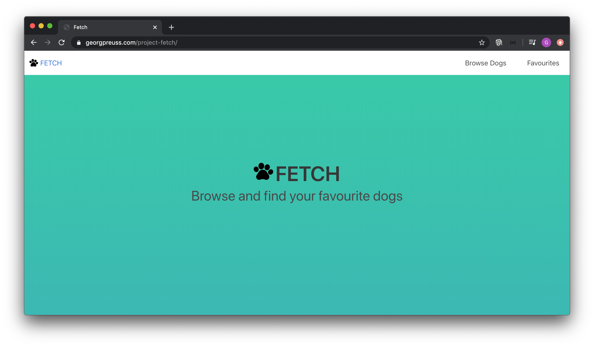
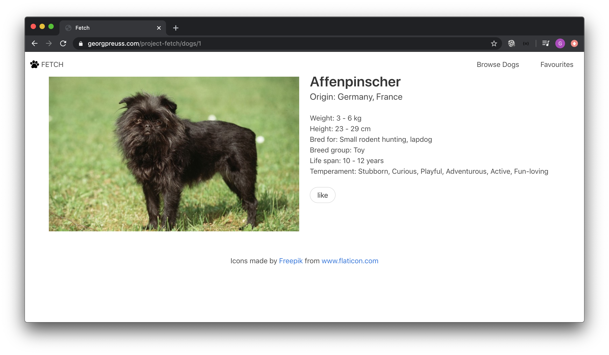

###  General Assembly, Software Engineering Immersive

# Fetch

## Overview
Fetch is an encyclopedia for dog lovers. Users can browse through hundreds of dogs and find out more about each dog. Dogs can also be added to a 'favourites' collection.

This is my second project of General Assembly's Software Engineering Immersive and the first real application of React. The assignment was to create a frontend application that hooks up to a publicly available API. This was a **paired programming** exercise for which we were given only **48 hours**.

You can launch the application on GitHub pages [here](https://georgpreuss.github.io/project-fetch/), or find the GitHub repo [here](https://github.com/georgpreuss/project-fetch/).

## Brief
- **Consume a public API** – this could be anything but it must make sense for your project
- **Have several components** - At least one classical and one functional
- **The app should include a router** - with several "pages"
- **Be deployed online** and accessible to the public

## Technologies used
- HTML
- JavaScript (ES6)
- React.js
- Bulma
- SCSS
- TheDogAPI

## Approach
- From the outset we decided to keep the website very simple: we wanted a landing page, a browse page, a single dog info page and a favourites page

```
const App = () => (
  <BrowserRouter basename="/project-fetch">
    <Navbar />
    <Switch>
      <Route exact path="/" component={Home} />
      <Route exact path="/dogs" component={Dogs} />
      <Route exact path="/dogs/favourites" component={FavouriteDogs} />
      <Route exact path="/dogs/:id" component={SingleDog} />
    </Switch>
  </BrowserRouter>
)
```

- As we were instructed to have a 'driver' and a 'coder' we took turns building up the website component by component
- Due to the nature of the API we had to design the browse page with a sequence of get requests
- First we would get and store all the available information:

```
componentDidMount() {
    axios.get('https://api.TheDogAPI.com/v1/breeds')
      .then(res => {
        this.setState({ dogs: res.data })
        this.fetchImages(res.data)
      })
      .catch(err => console.log(err))
  }
```

- And then fetch images with:

```
fetchImages(dogs) {
    const allDogs = [...dogs]
    for (let i = 1; i < 4; i++) {
      axios.get(`https://api.thedogapi.com/v1/images/search?breed_id=${i}`)
        .then(res => {
          allDogs.forEach((dog, index) => {
            if (dog.id === i) {
              dogs[index].img = res.data[0].url
            }
          })
          this.setState({ dogs: allDogs })
        })
    }
  }
```

- This unfortunately had to be limited as a precaution in order not to exceed any API call limitation

## Screenshots



## Bugs
- Not really a bug, but a limitation we wish we had known at the start:
	- images require one API call per dog and can't be obtained with all the other information in a single call
	- there was no explicit mention of a call limit but we didn't want to push our luck making hundreds of calls each time the browse page rendered so we decided to only load the first 3 images

## Potential future features
- A search function to look for dogs by name, breed, etc.
- A more polished design
- An 'adopt a dog' feature, possibly using a different API to determine dogs up for adoption in your area

## Lessons learned
- Spend enough time understanding the structure of the API you are using so you don't run into similar issues